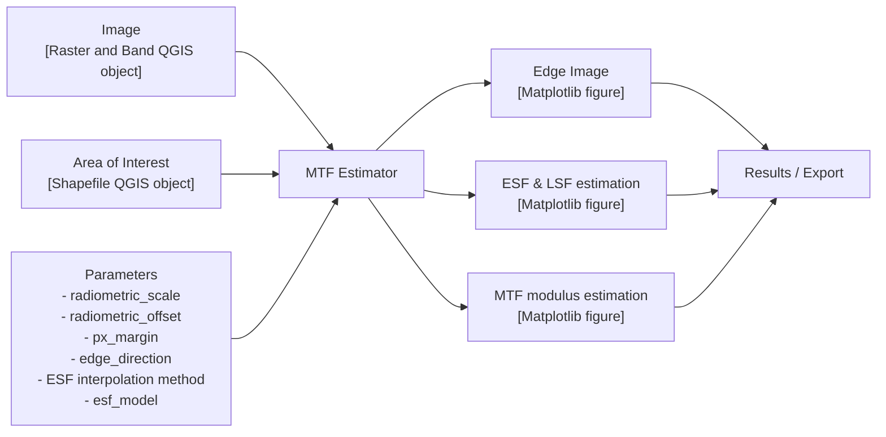
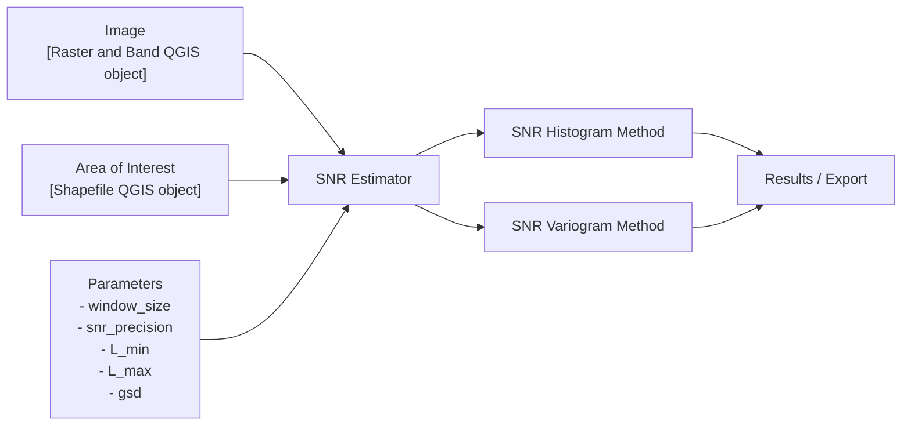
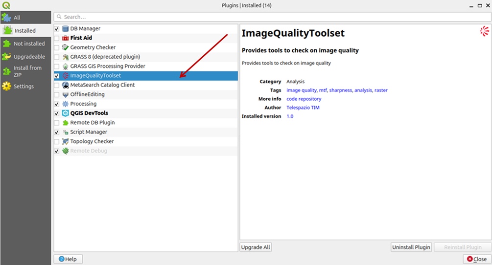
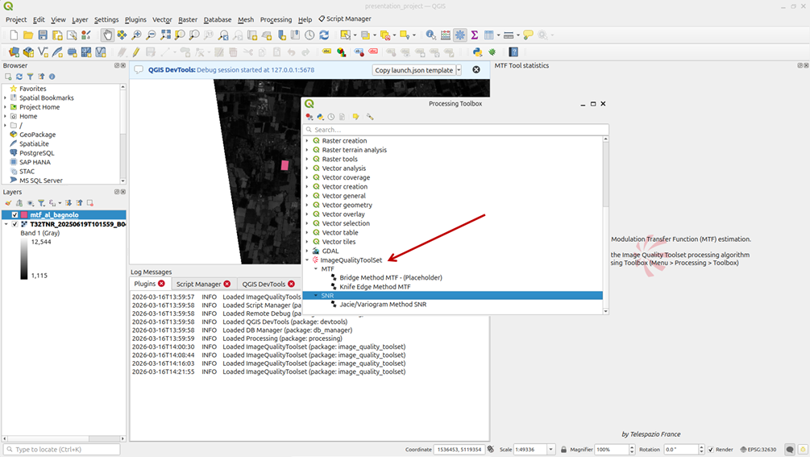

# Image Quality Toolset — MTF & SNR Computation

## 1. Overview

The Image Quality Toolset is a QGIS plugin developed in the context of the ESA **AI4QC** project. It is an open-source plugin interfacing with the Quantum Geographic Information System (**QGIS**) software, aimed at computing image quality metrics to establish sensor performance. It has been developed for remote sensing Calibration / Validation users as a supporting tool for Quality Control (**QC**) of satellite image.

It provides a QGIS plugin and a command-line interface to perform image quality assessments from Regions of Interest (**ROIs**) defined on an input image. ROIs are processed to derive Modulation Transfer Function (**MTF**) and Signal-to-Noise Ratio (**SNR**) related image quality measures. Results can be exported / saved into a standardised report.

Three methods are available:
- **MTF Knife Edge Method**
- **MTF Pulse Method**
- **SNR Method**

Both usage modes share the same underlying algorithms:

| Mode | Entry point |
|---|---|
| QGIS Plugin | Processing Toolbox → ImageQualityToolset |
| Command Line | `image_quality_toolset/scripts/mtf_computer.py` |

> **Note:** The command line interface additionally allows defining an ROI using pixel coordinates (crop window), whereas the QGIS plugin requires a shapefile ROI.

---

## 2. Algorithms

### 2.1 Knife Edge MTF

The MTF Knife Edge method estimates the Modulation Transfer Function of an image displaying a sharp image transition between two uniform areas (as close as possible to a step edge function).

- **MTF Estimator**:

The processing workflow follows these steps:

| Function | Description |
|---|---|
| Pre Processing | Conversion to radiance; Configuration checking |
| Edge Modelling | Determine the location of the edge and its angle with respect to the Along-track (AL) and Across-track (CT) directions |
| Edge Spread Function (ESF) construction | Compute oversampled ESF (non-equally spaced); Apply selected ESF model |
| Calculation of MTF | Compute LSF (numerical differentiation); Normalize LSF; Fast Fourier Transform on the normalized LSF |
| Reporting | Spatial Resolution Analysis report (PNG file x2); GeoPackage (.gpkg) |



Several quality metrics are derived from the ESF, including SNR of the method, Relative Edge Response (RER), Half Edge Extent (HEE), and the R2 error. The interpolated ESF is then differentiated to obtain the Line Spread Function (LSF). From the LSF, the Full Width at Half Maximum (FWHM) is computed. Finally, a Fast Fourier Transform (FFT) is applied to the LSF to obtain the MTF. From the resulting MTF curve, several metrics are extracted, including MTF at Nyquist frequency, MTF at 30% frequency, and MTF at 50% frequency.

#### ESF Models — Parametric fitting

| Model | Key | Description |
|---|---|---|
| Sigmoid | `sigmoid` | Standard sigmoid function |
| Hyperbolic tangent | `esf_tanh` | tanh-based model |
| Fermi function | `esf_fermi` | Fermi-Dirac distribution |
| Gaussian exponential | `esf_gauss_exp_param` | Parametric Gaussian-exponential model |
| Erf | `esf_erf` | Gaussian Error Function |

#### ESF Models — Non-parametric fitting

| Model | Key | Description |
|---|---|---|
| Loess | `esf_loess` | Local polynomial regression combining local regression models |
| Polynomial | `esf_polynomial` | Polynomial regression model |

### 2.2 MTF Pulse Method

Uses a pulse ROI (as close as possible to a Dirac function). Same processing as the Knife Edge method, except the ESF model is different. Functionality in progress.

### 2.3 SNR Estimator

- **SNR Estimator**:

The SNR Method computes SNR at the mean image radiance. It combines a SNR Histogram method with a SNR Variogram method. The Variogram method is more complex but provides more consistent SNR results.

Pre-processing involves conversion from digital number to radiance and configuration checking.



As reporting, beside a GeoPackage file, a panel figure is generated displaying:
- Selected ROI Image
- Image Histogram plot
- SNR Histogram plot
- Variogram plot

---

## 3. Installation

### 3.1 Requirements

- QGIS (version 3.40 Bratislava or later).
- Python environment compatible with QGIS plugin system.

### 3.2 QGIS Plugin — Automatic Installation

> **Note:** Automatic installation is planned for the end of the project and is not yet functional.

QGIS supports integration of plugins written in Python.

Steps:
1. In QGIS, go to **Plugins → Manage and Install Plugins…**
2. Search for **"image quality toolset"**.
3. Run the installation.

### 3.3 QGIS Plugin — Manual Installation

First, retrieve the code.

If you have Git access, clone the repository:
```bash
git clone https://gitlab2.telespazio.fr/isl/tim/edap/image-quality-tool
cd image-quality-tool
```

Otherwise, download the main branch (stable) or develop branch (unstable) as zip files. It is strongly suggested to start with the main branch.

On Linux, and with ```make``` installed, you can run:

```
make install
```
To install the plugin to the default QGIS plugin folder.

Alternatively, copy the `image_quality_toolset` directory into your machine's QGIS user plugins directory:

> **Warning:** `image_quality_toolset` is inside directory `image_quality_tool`.

**On Windows:**
```
C:\Users\<username>\AppData\Roaming\QGIS\QGIS3\profiles\default\python\plugins
```
(Replace `<username>` with your username, and `default` with your profile name if it's different.)

**On Linux:**
```
$HOME/.local/share/QGIS/QGIS3/profiles/default/python/plugins/
```
(Replace `default` with your profile name if it's different.)

To find out your profile name in QGIS, go to **Preferences > User Profiles** to see which one is selected.



Then, after opening QGIS, in **Plugins > Manage and Install Plugins > Installed**, the plugin **ImageQualityToolset** should appear. Check the box to enable it.



The plugin should now be available. To access it, select **Processing > Toolbox** and expand **ImageQualityToolset**.

### 3.4 Development Environment Setup

The preferred method is conda:

```bash
conda env create -f image_quality_toolset/environment.yml
conda activate mtf
```

The environment file installs Python 3.9 and all required dependencies (NumPy, SciPy, Matplotlib, GDAL, QGIS, etc.).

All mandatory libraries are listed in `image_quality_toolset/environment.yml`.

#### Environment Variable Setup

The `IMAGE_QUALITY_TOOL_HOME` environment variable must be set to the `image_quality_toolset` directory inside your clone. This variable must point to the `image_quality_toolset` directory in the cloned repository.

Set it as a conda environment variable so it is automatically available on activation:

With mtf env activated:

```bash
conda env config vars set IMAGE_QUALITY_TOOL_HOME=<path/to/image-quality-tool>
conda deactivate
conda activate mtf
```

> **Note:** Replace `<path/to/image-quality-tool>` with the actual path to the cloned repository on your system.

> **Note:** After `conda env config vars set`, a deactivate/activate cycle is required for the variable to take effect.

You can verify it is set correctly:

```bash
echo $IMAGE_QUALITY_TOOL_HOME
```

#### PYTHONPATH Configuration

Add `IMAGE_QUALITY_TOOL_HOME` to your Python path so that internal modules are importable:

```bash
conda env config vars set PYTHONPATH=${PYTHONPATH}:${IMAGE_QUALITY_TOOL_HOME}/image_quality_toolset
conda deactivate
conda activate mtf
```

---

## 4. Usage — QGIS Plugin

### 4.1 Available Methods

In the Processing Toolbox, under **ImageQualityToolset**, 3 methods are available:

- **Bridge Method MTF**
- **Knife Edge Method MTF**
- **Variogram Method SNR**

All these methods need an image and a ROI to work.

### 4.2 Image Selection

To select an image you can drop an image into the QGIS interface or use **Layer > Add Layer > Add Raster Layer…** and then select an image as Raster dataset.

### 4.3 ROI Preparation

#### 4.3.1 ROI Creation

To create an ROI use **Create Layer > New Shapefile Layer**.

Then a window appears in which the following fields must be completed:
- **File name**: name of the ROI, a path can also be selected using `...`
- **Geometry type**: pick **Polygon**

Other fields are not mandatory.

#### 4.3.2 ROI Edition

Use **Toggle Edition** then **Add Polygon Feature**.

Then select the 4 points on the image to make the wanted ROI.

Use right-click to validate and press OK (id is optional).

### 4.4 Running a Method

In the Processing Toolbox, double-click on the desired method to open its parameter panel.

For **Knife Edge Method MTF**, the following parameters must be filled:

- Radiometric Scale
- Radiometric Offset
- Sampling Factor
- Orientation Angle
- Pixel Margin
- MTF Profile
- ESF Model
- Raster Layer
- Band Number
- Area of interest

For the **SNR Method**, the following parameters must be filled:

- Window Size
- SNR Precision
- L min (radiance minimum)
- L max (radiance maximum)
- GSD (Ground Sample Distance in meters)
- Raster Layer
- Band Number
- Area of Interest

---

## 5. Outputs

### 5.1 MTF Processing Report (Knife Edge / Pulse)

The MTF Estimator produces two levels of output depending on user needs:

#### 5.1.1 Synthetic view

When the MTF Estimator finishes processing, a synthetic figure is produced as a 2×3 grid of six panels providing an at-a-glance summary of the main results:

| Position | Panel | Description |
|----------|-------|-------------|
| Top-left | **ESF / LSF / MTF** | Normalized ESF, inflection point, LSF, FWHM marker, and Heaviside step function, all centered on the ESF inflection point |
| Top-center | **Metrics Summary** | Text panel reporting: computation method, sampling factor, ROI dimensions (lines × columns), rotation angle, ESF length, MTF@Nyquist, MTF30, MTF50, SNR, RER, RER sample points, HEE upper/lower, FWHM, and R² |
| Top-right | **MTF Curve** | MTF modulus vs. spatial frequency (Nyquist = 0.5 cy/px), with horizontal and vertical markers at MTF30, MTF50, and MTF@Nyquist |
| Bottom-left | **ESF Interpolation** | Original ESF samples overlaid with the 2nd-order polynomial interpolated ESF |
| Bottom-center | **HEE and RER** | Normalized ESF with 5 %, 50 %, and 95 % threshold lines, HEE lower and upper regions highlighted, and the two RER sample points marked |
| Bottom-right | **LSF** | Line Spread Function normalized to its maximum |

#### 5.1.2 Outputs export option

If an **Analysis output directory** is provided in QGIS, three files are written to that directory after each successful run:

---

**1. Synthetic view** — `figure_<alg_id>_<datetime>.png`

The synthetic view described in [5.1.1](#511-synthetic-view) is saved as a PNG file.

---

**2. Detailed analysis panel** — `figure2_<alg_id>_<datetime>.png`

A second 2×3 figure providing deeper diagnostic information on the edge detection and ESF construction:

| Position | Panel | Description |
|----------|-------|-------------|
| Top-left | **Inflexion point location** | ROI image (grayscale) with detected subpixel edge positions overlaid as red markers |
| Top-center | **Oversampled / Projected Edge** | Oversampled and projected edge image (perpendicular direction), zoomed around the centre, with a colorbar |
| Top-right | **Orientation angle estimate** | Scatter of inflexion point positions with linear fit, showing estimated angle, refined angle, and angular uncertainty |
| Bottom-left | **Input ESF** | Binned ESF mean values with ±1σ envelope and per-bin sample count histogram |
| Bottom-center | **Normalized input ESF** | Normalized and centered cleaned ESF point cloud (non-equally-spaced bins above the sample threshold) with Heaviside overlay and bin statistics |
| Bottom-right | **Normalized interpolated ESF** | Normalized interpolated ESF (equi-spaced) with Heaviside overlay, used as input to LSF and MTF computation |

---

**3. GeoPackage report** — `report.gpkg`

A cumulative GeoPackage that accumulates one polygon feature per analysis run. Each feature carries the ROI geometry (MultiPolygon, in the CRS of the ROI layer) and the following attribute fields:

| Field | Type | Description |
|-------|------|-------------|
| `fid` | Integer | Auto-generated unique identifier |
| `date` | DateTime | UTC timestamp of the analysis |
| `log` | String | Full QGIS processing log for the run |
| `figure_filename` | String | Filename of the exported synthetic view PNG |
| `RASTER` | String | File-system path of the input raster |
| `BAND` | Integer | Band number used |
| `SCALE` | Double | Radiometric scale factor applied to DN values |
| `OFFSET` | Double | Radiometric offset applied to DN values |
| `PX_MARGIN` | Integer | Pixel margin used for edge extraction |
| `EDGE_DIRECTION` | String | Edge direction (`Along Track` or `Across Track`) |
| `ESF_MODEL` | String | ESF parametric model selected |
| `SAMPLING` | Double | Oversampling factor |
| `INPUT_ROTATION` | Double | Input rotation angle in degrees (optional) |
| `esf_length` | Double | Number of points in the interpolated ESF |
| `MTF_NYQ` | Double | MTF value at Nyquist frequency |
| `MTF30` | Double | Spatial frequency (cy/px) at MTF = 30 % |
| `MTF50` | Double | Spatial frequency (cy/px) at MTF = 50 % |
| `SNR` | Double | Signal-to-Noise Ratio |
| `RER` | Double | Relative Edge Response |
| `HEE_upper` | Double | Half Edge Extent — upper half (subpixels) |
| `HEE_lower` | Double | Half Edge Extent — lower half (subpixels) |
| `FWHM` | Double | Full Width at Half Maximum (pixels) |
| `R2` | Double | Coefficient of determination of the ESF fit |

If `report.gpkg` already exists in the output directory, new results are appended as additional features. If the existing file has incompatible fields, an error is reported and the feature is not written.

### 5.2 SNR Processing Report

The SNR Estimator produces a single multi-panel figure with four graphs:

| Graph | Description |
|---|---|
| **Top-left — "SNR Points"** | Input image in grayscale with selected uniform pixels overlaid; text box shows percentage of pixels retained by the mask |
| **Top-right — "Variogram"** | Variogram (blue dots/line) and the fitted model. X-axis: distance in meters; Y-axis: semi-variance γ(h) |
| **Bottom-left — "Radiance Distribution"** | Step histogram of pixel count per radiance bin (1 W/(m².str.µm) bins); text box shows mean and standard deviation of radiance values |
| **Bottom-right — "SNR Method"** | Step histogram of per-pixel local SNR values; text box annotates peak SNR value and its corresponding reference radiance |

---

## 6. Parameters Reference

Both the QGIS Processing Toolbox interface and the command-line interface share the same underlying parameters.

### 6.1 Common Parameters

These parameters apply to both the MTF Estimator and the SNR Estimator, regardless of the interface used.

| Parameter | Description |
|---|---|
| `Raster layer` | Input image layer (any GDAL-supported format: TIFF, etc.) |
| `Band number` | Band to process (1-based index). Default: 1 |
| `Area of interest` | Polygon vector layer (shapefile) defining the ROI |

### 6.2 MTF Estimator — Specific Parameters

| Parameter | Type | Default | Description |
|---|---|---|---|
| `radiometric_scale` | Float | 0.01 | Radiometric conversion scale of the sensor |
| `radiometric_offset` | Float | 0.0 | Radiometric offset correction factor |
| `px_margin` | Integer | 1 | Number of pixels to exclude at the edges of the ROI during edge detection |
| `edge_direction` | Enum | AL | Orientation of the edge: `AL` (Along Track) or `CT` (Across Track) |
| `esf_model` | Enum | sigmoid | Analytical model for ESF fitting (Parametric only): `sigmoid`, `esf_tanh`, `esf_fermi`, `esf_gauss_exp_param`, `esf_erf`; or non-parametric: `esf_loess`, `esf_polynomial` |

### 6.3 SNR Estimator — Specific Parameters

| Parameter | Required | Description |
|---|---|---|
| `window_size` | yes | Window size for uniform filter (e.g., `5`) |
| `snr_precision` | yes | SNR precision/bins width (e.g., `1.0`) |
| `L_min` | no | Minimum radiance for SNR computation. If omitted, uses all valid pixels |
| `L_max` | no | Maximum radiance for SNR computation. If omitted, uses all valid pixels |
| `gsd` | no | Ground Sample Distance in meters (default: `30`) |
| `nb_samples` | no | Number of sample points for variogram (default: `5000`) |
| `lag` | no | Number of lag classes for variogram (default: `25`) |
| `run_variogram_comparaison` | no | If `true`, run both skgstat and local implementations and compare results (default: `false`) |

---

## 7. Usage — Command Line

Scripts are available in `image_quality_toolset/scripts/` to run algorithms from the command line using INI configuration files.

### 7.1 Prerequisites

- Git installed
- Conda (Miniconda or Anaconda) installed
- Development environment set up (see [Section 3.4](#34-development-environment-setup))

### 7.2 Running a Script

From the root of the cloned repository, with the `mtf` conda environment active:

```bash
python image_quality_toolset/scripts/mtf_computer.py --config_file <path/to/my_config.ini>
```

Or using a pre-configured example:

```bash
python image_quality_toolset/scripts/mtf_computer.py --config_file image_quality_toolset/data/config_files/pan_target_MTF.ini
```

Results are displayed as Matplotlib figures. If debug is enabled, figures are also saved to the directory specified in `[debug] dir`.

### 7.3 Configuration File Format

The script takes an INI configuration file as input. The file is organised in three sections: `[input]`, `[parameters]` and `[debug]`.

#### `[input]` section

| Parameter | Required | Description |
|---|---|---|
| `image_path` | yes | Absolute path to the input image (TIFF or similar GDAL-supported format). Environment variables are expanded. |
| `ROI` | no | Region of Interest. Either a path to a shapefile (`.shp`) or a dictionary defining a crop window: `{'line': <start>, 'pixel': <start>, 'line_number': <h>, 'pixel_number': <w>}`. If omitted, the full image is processed. |

#### `[parameters]` section

| Parameter | Required | Description |
|---|---|---|
| `method` | yes | Algorithm to use: `MTF` (MTF Estimator) or `SNR` (SNR Estimator) |
| `band` | yes | Band number to process (1-based) |
| `radiometric_scale` | MTF only | Radiometric conversion scale (float). Default: `0.01` |
| `radiometric_offset` | MTF only | Radiometric offset correction factor (float). Default: `0.0` |
| `px_margin` | MTF only | Pixel margin for edge extraction (integer). Default: `1` |
| `edge_direction` | MTF only | Edge direction: `AL` (Along Track) or `CT` (Across Track) |
| `esf_model` | MTF only | ESF analytical model: `sigmoid`, `esf_tanh`, `esf_fermi`, `esf_gauss_exp_param`, `esf_erf`, `esf_loess`, `esf_polynomial` |

#### `[debug]` section

| Parameter | Required | Description |
|---|---|---|
| `enabled` | no | Enable debug output (`true` / `false`). Default: `false` |
| `dir` | no | Absolute path to the directory where output figures are saved |

### 7.4 Configuration Examples

Paths in configuration files support environment variable expansion (e.g. `$IMAGE_QUALITY_TOOL_HOME`). Replace `<path/to/image.tif>`, `<path/to/roi.shp>` and `<path/to/output>` with your actual paths:

#### MTF with crop window

```ini
[input]
image_path = <path/to/image.tif>
ROI = {'line': 13, 'pixel': 21, 'line_number': 16, 'pixel_number': 40}

[parameters]
method = MTF
band = 1
radiometric_scale = 0.01
radiometric_offset = 0.0
px_margin = 1
edge_direction = AL
esf_model = sigmoid

[debug]
enabled = true
dir = <path/to/output>
```

### 7.5 Available Configuration Files

Pre-configured configuration files are available in `test/data/config_files/`:

| Config file | Method | Dataset | ROI type |
|---|---|---|---|
| `bagnolo_MTF.ini` | MTF | Sentinel-2 (target1) | Shapefile |
| `pan_target_MTF.ini` | MTF | PAN target (target2) | Crop window |
| `pneo_MTF.ini` | MTF | Pléiades Neo (target3) | Shapefile |
| `desert_SNR.ini` | SNR | Landsat-9 (target4) | Shapefile |

---

## 8. Data

The algorithms need an image and a ROI (Region of Interest) to work. Example datasets are available in the `test/data/` directory:

- **`test/data/target1/`** — Bagnolo dataset: a Sentinel-2 raster (`T32TNR_20250619T101559_B04_10m_mtf_roi.tiff`) with a shapefile ROI (`shapefile/mtf_al_bagnolo.shp`). Used by `bagnolo_MTF.ini`.
- **`test/data/target2/`** — PAN target dataset: a PAN image (`S100199aI_002_2_PAN_L0R_mtf_target.tif`) with a crop window ROI defined directly in the config. Used by `pan_target_MTF.ini`.
- **`test/data/target3/`** — Pléiades Neo dataset: a multispectral image (`IMG_PNEO4_*.tif`) with a shapefile ROI (`shapefile/roi_mtf2.shp`). Used by `pneo_MTF.ini`.
- **`test/data/target4/`** — Desert dataset: a Landsat-9 raster (`LC09_L1TP_181040_20211121_20230505_02_T1_B5_rad_crop_2.tif`) with a shapefile ROI (`shapefile/ROI.shp`). Used by `desert_SNR.ini`.

Note that shapefiles consist of multiple files (`.shp`, `.dbf`, `.shx`, `.prj`, `.cpg`, `.qix`) — all must be present for the shapefile to be functional.

> **Note — geometry-free images**: The algorithms do not require the input image to have embedded geographic metadata (CRS, geotransform). A plain raster with no projection (like `target2`) is fully supported; the ROI can be defined as a pixel crop window in the config instead of a shapefile.

> **Note — radiometric calibration**: The `scale` and `offset` parameters in the config control the conversion from raw DN to radiance (`radiance = DN × scale + offset`). These values are sensor- and product-specific and must be set by the user according to the image provider's documentation. No automatic calibration is applied.

---

## 9. Roadmap

The final version of the plugin will include:

1. **MTF computation from a knife edge ROI** — MTF Knife Edge Method (implemented).
2. **MTF computation from a pulse ROI** — MTF Pulse Method (implemented).
3. **SNR computation** — SNR Method (implemented).
4. **Automatic installation** via QGIS Plugin Manager (planned).

---
